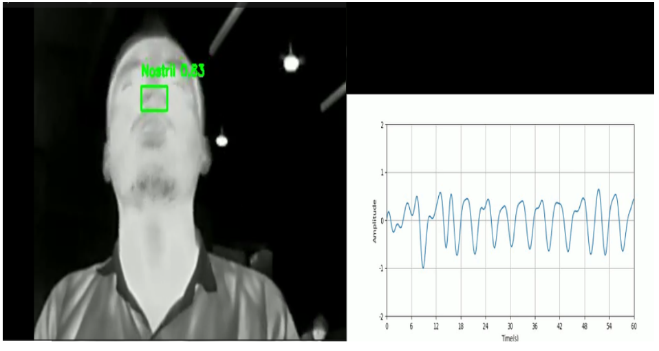

<<<<<<< HEAD
#  Screen Apnea – Thermal-Based Respiration Monitoring & Apnea Detection System

_A non-contact thermal imaging system for respiration monitoring and shallow breathing detection using YOLOv8 and signal processing._

---

## 📌 Table of Contents
- <a href="#overview">Overview</a>
- <a href="#problem-statement">Problem Statement</a>
- <a href="#dataset">Dataset</a>
- <a href="#tools--technologies">Tools & Technologies</a>
- <a href="#project-structure">Project Structure</a>
- <a href="#methodology">Methodology</a>
- <a href="#model-performance">Model Performance</a>
- <a href="#signal-validation--results">Signal Validation & Results</a>
- <a href="#key-insights">Key Insights</a>
- <a href="#sample-output">Sample Output</a>
- <a href="#how-to-run-this-project">How to Run This Project</a>
- <a href="#future-work">Future Work</a>
- <a href="#author--contact">Author & Contact</a>

---

<h2><a class="anchor" id="overview"></a>Overview</h2>

This project presents a **non-contact respiration monitoring system** using thermal imaging.  
The objective is to build an affordable, privacy-friendly solution capable of detecting shallow breathing and apnea-related anomalies without wearable sensors.

The project was developed in two phases:

- **Phase 1 – Screen Apnea**
  - 12 participants
  - YOLOv8-based nostril detection
  - Respiration signal extraction
  - Chest belt validation (4 participants)

- **Phase 2 – Extended Respiration Study**
  - 45 participants
  - Full-length respiration pattern extraction
  - Foundation for apnea event classification

---

<h2><a class="anchor" id="problem-statement"></a>Problem Statement</h2>

Traditional apnea detection systems:

- Require wearable devices (chest belts, nasal cannula)
- Are uncomfortable for long-term use
- Operate mostly in lab-controlled environments
- Have high setup costs

This project aims to develop:

- A non-contact respiration monitoring system
- Real-time nostril detection in thermal images
- Frequency-based respiration validation
- Edge-device compatible solution

---

<h2><a class="anchor" id="dataset"></a>Dataset</h2>

### Phase 1 – Screen Apnea
- 12 participants
- 10–15 minutes recording per participant
- Thermal recordings using TOPDON TC View
- Chest belt ground truth for 4 participants

### Phase 2 – Extended Study
- 45 participants
- 3500+ annotated thermal frames
- Long-duration respiration extraction

---

<h2><a class="anchor" id="tools--technologies"></a>Tools & Technologies</h2>

- Python
- YOLOv8 (Ultralytics)
- OpenCV
- NumPy
- SciPy (Signal Processing)
- Label Studio (Annotation)
- Jupyter Notebook
- Thermal Camera (TOPDON TC View)
- Git & GitHub

---

<h2><a class="anchor" id="project-structure"></a>Project Structure</h2>

```
ScreenApnea/
│
├── README.md
├── .gitattributes
│
├── CollectedData/
│   ├── Gajendra2025-02-1615-03-39.avi
│   └── thermalvideo.txt
│
├── Frameextraction/
│   └── 01gajframes/
│       ├── 01frame[0-261].png            (~262 files)
│       └── 01varied[22-258].png          (~150 files)
│
├── Resultanalysisallfile/
│   ├── P011/  (*.csv: EXP-1*, ex1*, meanpixel*, processedchestresp)
│   ├── P012/  (*.csv: EXP-2*, ex2*, downsample*, exp2)
│   │          graphs.png
│   │          thermalrec2.avi
│   ├── P013/  (*.csv: EXP-3*, ex3*)
│   │          output.png
│   │          thermalrec3.avi
│   └── P014/  (*.csv: EXP-4*, ex4*)
│              thermalrec4.avi
│
├── YOLOModelTraining/
│   ├── .venv/Lib/site-packages/          (pip packages, *.pyc, *.py – thousands)
│   ├── best.pt
│   ├── data.yaml
│   ├── *.ipynb                           (main100, mean, mean1, sc)
│   │
│   ├── runs/
│   │   ├── detect/
│   │   └── train[1-8]/
│   │       ├── args.yaml (x8)
│   │       ├── events.out.tfevents.* (x8)
│   │       └── labels.jpg (x8)
│   │
│   ├── train/images/                     (~400 files)
│   │   ├── 01frame[0-261].png
│   │   └── 01varied*
│   │
│   ├── test/images/                      (~200 files)
│   │   ├── 01-12frame*
│   │   └── 01-12varied*
│   │
│   └── labels/                           (~2000 files)
│       ├── 01-12frame*.txt
│       └── 01-12varied*.txt
```
---

<h2><a class="anchor" id="methodology"></a>Methodology</h2>

### 1️⃣ Data Collection
- Thermal video recording of face region
- Natural sitting/sleeping conditions
- Chest belt ground truth (subset)

### 2️⃣ Frame Extraction & Annotation
- Extracted frames from thermal videos
- Manual nostril ROI annotation
- Created 3500+ labeled images

### 3️⃣ Model Training – YOLOv8

Trained multiple configurations:

- Image Size: 640, 1280
- Epochs: 100–300
- Augmentation enabled/disabled

Evaluation Metrics:

- Precision
- Recall
- mAP@0.5
- mAP@0.5:0.95

### 4️⃣ Respiration Signal Extraction

- Detect nostril ROI
- Extract mean pixel intensity per frame
- Downsample to 20 Hz
- Apply bandpass filter (0.1–0.5 Hz)

---

<h2><a class="anchor" id="model-performance"></a>Model Performance</h2>

Final Model: **YOLOv8n (Train_2 Configuration)**

- mAP@0.5 = 0.978
- mAP@0.5:0.95 = 0.815
- Real-time detection capability
- Suitable for edge deployment

---

<h2><a class="anchor" id="signal-validation--results"></a>Signal Validation & Results</h2>

- 20-second window segmentation
- 120 total windows analyzed
- Compared thermal frequency vs chest belt frequency

Results:

- Mean MAE: 0.31 Hz
- Mean RMSE: 0.31 Hz
- Strong correlation with ground truth
- Filtering reduced error by ~50% in some participants

---

<h2><a class="anchor" id="key-insights"></a>Key Insights</h2>

- Thermal nostril ROI can accurately estimate respiration frequency
- Bandpass filtering significantly improves signal clarity
- Errors remained minimal in most windows
- Real-time inference is feasible
- Non-contact monitoring works in natural environments

---

<h2><a class="anchor" id="sample-output"></a>Sample Output</h2>

```markdown

```

Or resize using HTML:

```html

```

---

<h2><a class="anchor" id="how-to-run-this-project"></a>How to Run This Project</h2>

1. Clone repository:

```bash
git clone https://github.com/gajendramandal/Screen_Apnea.git
cd Screen_Apnea
```

2. Install dependencies:

```bash
pip install -r requirements.txt
```

3. Run YOLO detection:

```bash
yolo detect predict model=YOLOModelTraining/best.pt source=video.mp4
```

4. Run signal processing notebook:

Open:

```
Frameextraction/main_1_0_0.ipynb
```

---

<h2><a class="anchor" id="future-work"></a>Future Work</h2>

- Apnea event annotation
- AHI estimation
- Severity classification
- Multi-ROI fusion (nostril + chest)
- Clinical validation
- Real-time embedded deployment

---

<h2><a class="anchor" id="author--contact"></a>Author & Contact</h2>

**Gajendra Mandal**  
B.Tech (Hons.) Data Science  
IIT Gandhinagar (Internship Project)  

🔗 GitHub: https://github.com/gajendramandal  
📧 Email: gajendramandal2003@gmail.com
=======
# Screen_Apnea
```
ScreenApnea/
.gitattributes
CollectedData/
├── Gajendra2025-02-1615-03-39.avi
└── thermalvideo.txt
Frameextraction/
└── 01gajframes/
    ├── 01frame[0-261].png (~262 files)
    └── 01varied[22-258].png (~150 files)
Resultanalysisallfile/
├── P011/ (*.csv: EXP-1*, ex1*, meanpixel*, processedchestresp)
├── P012/ (*.csv: EXP-2*, ex2*, downsample*, exp2; graphs.png, thermalrec2.avi)
├── P013/ (*.csv: EXP-3*, ex3*; output.png, thermalrec3.avi)
└── P014/ (*.csv: EXP-4*, ex4*; thermalrec4.avi)
YOLOModelTraining/
├── .venv/Lib/site-packages/ (pip packages, *.pyc, *.py - thousands)
├── best.pt
├── *.ipynb (main100, mean, mean1, sc)
├── data.yaml
├── runs/
│   ├── detect/
│   └── train[1-8]/ (args.yaml x8, events.out.tfevents.* x8, labels.jpg x8)
├── test/images/ (*.png: 01-12frame*, 01-12varied* - ~200 files)
├── labels/ (*.txt: 01-12frame*, 01-12varied* - ~2000 files)
└── train/images/ (01frame[0-261].png, 01varied* - ~400 files)
README.md
```
>>>>>>> b1cf2951c1b0af4d085896d40caceae4e24415c9

